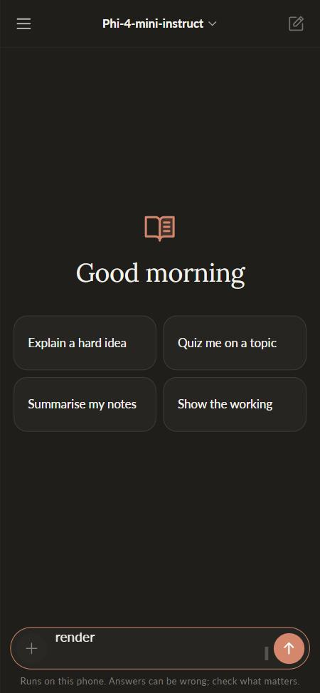
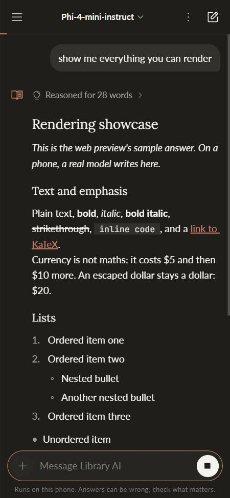
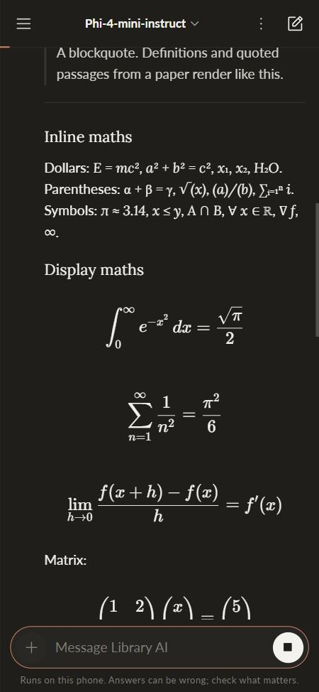
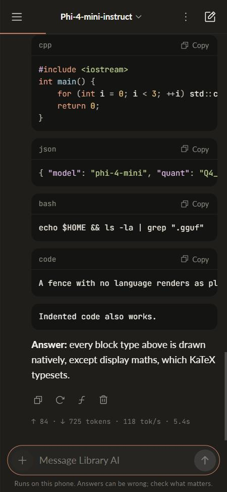
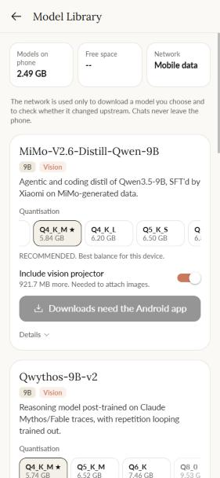
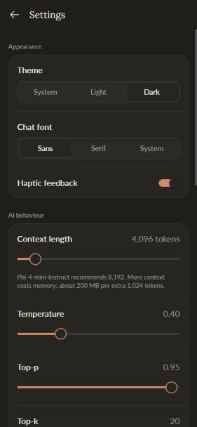
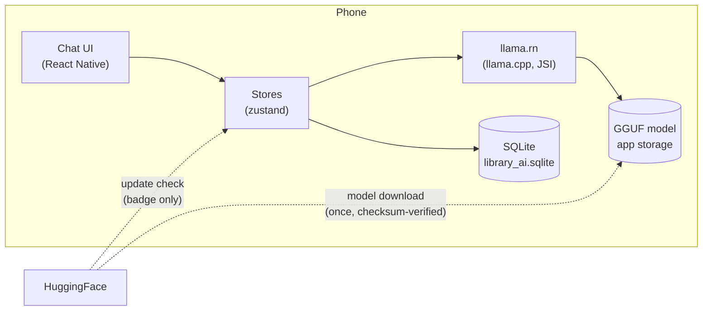

<div align="center">


# Library AI

**Learn anywhere. No internet required.**

A private AI study companion that runs open-weight language models entirely on your phone.<br/>
Chat, maths, code and your whole history keep working with the radio off.

[](https://github.com/omsenjalia/Lib-AI/releases/latest)
[](https://github.com/omsenjalia/Lib-AI/actions/workflows/mobile-ci.yml)


<br/>






<sub>Screens from the interface preview. On a phone, the replies come from a model running on the device.</sub>

</div>

---

## Why

Most AI study tools stop working the moment you lose signal, and every question
you ask leaves your phone. Library AI downloads a model once, then answers
entirely on-device with [llama.cpp](https://github.com/ggml-org/llama.cpp). No
account, no server, no analytics. Your conversations live in one SQLite file in
the app's private storage.

## Features

<table>
<tr>
<td width="50%" valign="top">

**Chat that reads like a hosted assistant**
- Streaming replies with a breathing mark while the model writes
- Reasoning models' thinking folded into "Reasoned for N words"
- Edit and resend, regenerate, copy, delete
- Claude Code-style readout: `✻ Writing… (4.2s · ↓ 312 tokens · 41.2 tok/s)` live, and `↑ 1.2k · ↓ 312 tokens · 41.2 tok/s · 7.9s` under every reply
- Context meter along the top bar, amber at 75%, red at 90%

</td>
<td width="50%" valign="top">

**Built for studying**
- Markdown: headings, lists, tasks, quotes, tables
- Maths: display equations typeset by KaTeX with bundled fonts; inline maths as clean Unicode (`∑ᵢ₌₁ⁿ`, `∀ x ∈ ℝ`)
- Code: highlighted, horizontally scrollable, one-tap copy
- Six study personas (tutor, maths and physics, exam coach...) plus your own
- Camera and gallery input for vision models (OCR mode)
- Export a chat as a PDF with typeset maths, or as Markdown

</td>
</tr>
<tr>
<td valign="top">

**Models, handled carefully**
- Six catalogued models with exact sizes and SHA-256 checksums
- Resumable downloads (HTTP Range), pause from the notification
- Free space and Wi-Fi checks before a byte is fetched
- A file is not a model until its checksum matches
- Update checks that only ever show a badge, never download

</td>
<td valign="top">

**Designed, not defaulted**
- Warm ivory and charcoal themes, one clay accent, no shadows
- Lora, Lato and JetBrains Mono, bundled
- Sidebar with search across titles and message text, pinning, swipe to delete with Undo
- Bottom sheets, spring presses, haptics
- Every animation respects the system's reduced-motion setting

</td>
</tr>
</table>

<p align="center">
  
  &nbsp;&nbsp;
  
</p>

## Install

1. Open the [latest nightly release](https://github.com/omsenjalia/Lib-AI/releases/latest) on your Android phone (8.0 or newer, arm64).
2. Download **`release.apk`**, open it, and allow "Install unknown apps" for your browser if asked.
3. Open **Model Library** in the app and download a model. Start with **Phi-4 mini** (2.49 GB) on most phones.
4. Turn on aeroplane mode. It still works.

Each release lists the APK's SHA-256 and, when configured, a VirusTotal report.

## Models

Sizes and checksums are generated from HuggingFace's file tree by
[`tool/generate_models_catalogue.py`](tool/generate_models_catalogue.py) and
bundled with the app, so it knows its models on a phone that has never been
online.

Every model is chosen to load with 4 to 5 GB of free RAM. "RAM needed" is for
text chat; image input adds the vision projector on top.

| Model | Size class | Recommended quant | RAM needed | Notes |
|---|---|---|---|---|
| `qwen3.5-2b` | 2B | Q4_K_M · 1.28 GB | ~1.8 GB | Vision (+0.67 GB), lightest |
| `gemma-4-e2b` | E2B | QAT UD-Q4_K_XL · 2.62 GB | ~3.1 GB | Vision (+0.99 GB), Google, 128K window |
| `qwen3.5-4b` | 4B | Q4_K_M · 2.74 GB | ~3.3 GB | Vision (+0.68 GB) |
| `qwen3.5-4b-opus-4.6-distill` | 4B | Q4_K_M · 2.71 GB | ~3.3 GB | Text only, Claude Opus reasoning distil |
| `phi-4-mini-3.8b` | 3.8B | Q4_K_M · 2.49 GB | ~3.4 GB | 128K window, text only, MIT |
| `gemma-4-e4b` | E4B | QAT UD-Q4_K_XL · 4.22 GB | ~4.8 GB | Vision (+0.99 GB), Google, 128K window |
| `qwythos-9b-v2-compact` | 9B | IQ3_XXS · 4.41 GB | ~5.0 GB | Vision (+0.92 GB), 2 to 4 bit quants of Qwythos-9B-v2 |

Model weights are not bundled. Each carries its own licence from its
HuggingFace repository, shown on the model card before you download.

## How it works



Dotted lines are the only network traffic the app ever makes, and a test fails
the build if any other code reaches for the network. The full design, including
the load path, prompt budgeting, download resume rules and rendering pipeline,
is in **[mobile/ARCHITECTURE.md](mobile/ARCHITECTURE.md)**.

## Development

```bash
cd mobile
npm install
npm run fetch-native   # llama.rn's prebuilt Android/iOS libraries (run from PowerShell on Windows)
npx expo start --web   # interface preview in a browser, with a sample-answer engine
```

| Task | Command |
|---|---|
| Typecheck | `npx tsc --noEmit` |
| Lint | `npx expo lint` |
| Tests (131, including the offline boundary and real-SQLite migrations) | `npx jest` |
| Run on a device or emulator (JDK 17 + Android SDK) | `npx expo run:android` |
| Cloud APK without a local JDK | `npx eas-cli@latest build -p android --profile preview` |

New to the codebase? Read **[CLAUDE.md](CLAUDE.md)** first: the hard rules, the
conventions, and where everything lives.

### Adding or changing a model

1. Edit `REPOS` and `QUANTS` in `tool/generate_models_catalogue.py` with exact byte sizes and real SHA-256s.
2. Run `python3 tool/generate_models_catalogue.py`.
3. Copy `assets/models_catalogue.json` to `mobile/assets/models_catalogue.json`. The test suite fails if the two differ, and validates sizes, checksums, URLs and vision claims.

## Releases

| Workflow | When | What |
|---|---|---|
| [`mobile-ci.yml`](.github/workflows/mobile-ci.yml) | PRs and pushes touching `mobile/` | Typecheck, lint, tests, `expo-doctor`, Android bundle, then a release APK artifact |
| [`nightly-release.yml`](.github/workflows/nightly-release.yml) | Daily at 00:00 IST if `main` moved, or manually | Release APK, `apksigner` verification, SHA-256, VirusTotal scan, GitHub Release |

Signing uses these repository secrets. Without them the nightly is
debug-signed and its release notes say so; set them to the **same key the
Flutter app shipped with** so the new app installs over it and keeps everyone's
chats and models.

| Secret | Purpose |
|---|---|
| `KEYSTORE_BASE64` | `base64 -w0 release.keystore` |
| `KEYSTORE_PASSWORD`, `KEY_ALIAS`, `KEY_PASSWORD` | Keystore credentials |
| `VIRUSTOTAL_API_KEY` | Optional; adds a scan report to each release |

## Repository

```
mobile/        the app (React Native, Expo SDK 57): src/, tests, config
assets/        models_catalogue.json, generated (source for the app's copy)
tool/          catalogue generator, the source of truth for model metadata
docs/          UI reference inventory, research brief, screenshots
lib/ android/  the original Flutter build, kept as a reference (docs/FLUTTER_README.md)
```

## Licence

No licence file is included, so the application code is all rights reserved by
default. Bundled fonts (Lato, Lora, JetBrains Mono) are under the SIL Open Font
License; llama.cpp, llama.rn, KaTeX and marked are MIT.

<div align="center">
<sub>Made for students who study on trains, in basements, and anywhere the signal gives up.</sub>
</div>
